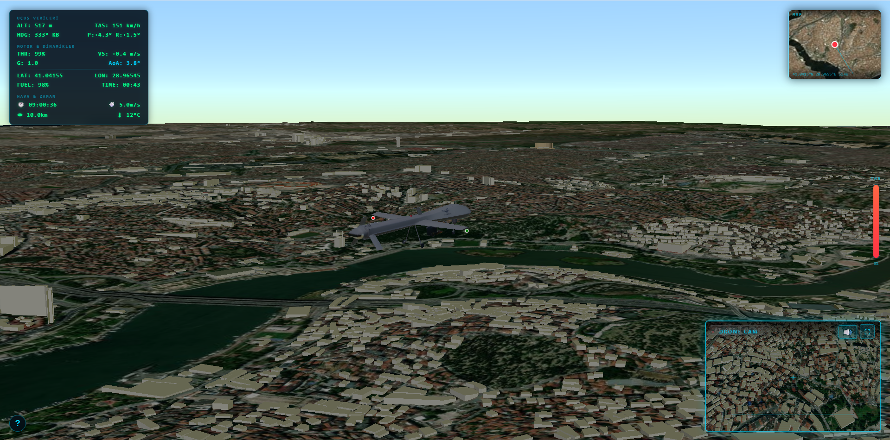
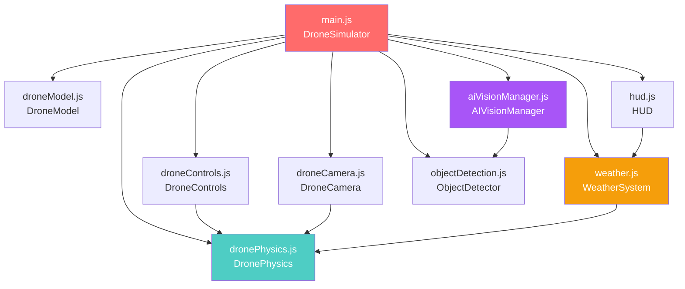
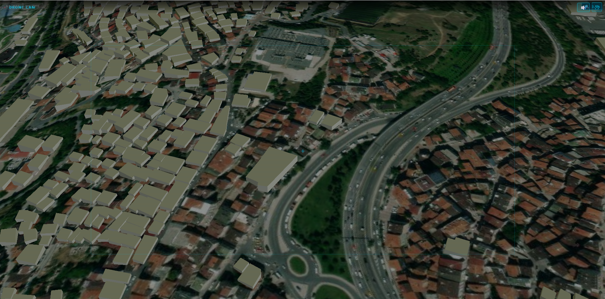
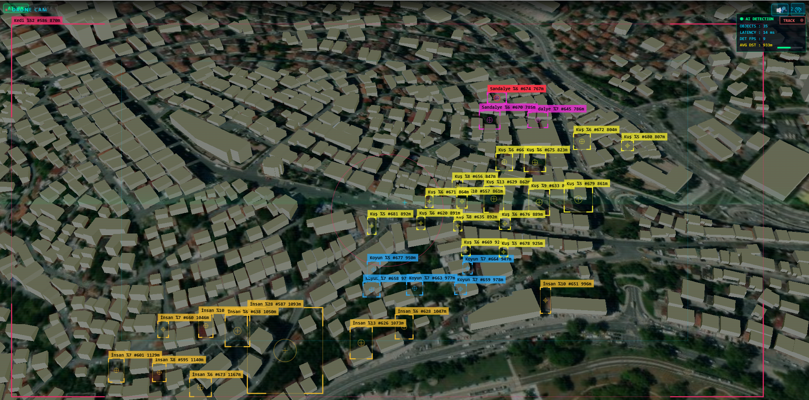
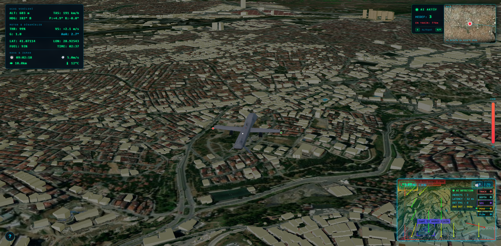

<p align="center">
  
  
  
  
  
</p>

<h1 align="center">🛩️ AI UAV SIMULATOR</h1>
<h3 align="center"><em>High-Fidelity Fixed-Wing UAV Flight Dynamics & AI Vision Platform</em></h3>

<p align="center">
  A browser-based, photorealistic 3D unmanned aerial vehicle simulator featuring a physics-accurate flight dynamics engine modeled after the <strong>MQ-1 Predator</strong>, integrated <strong>real-time AI computer vision</strong> powered by TensorFlow.js, and a dynamic <strong>weather & day/night cycle</strong> system — all rendered on a full-scale <strong>CesiumJS</strong> globe with real-world terrain and 3D buildings.
</p>

<p align="center">
  
</p>

---

## 📋 Table of Contents

- [Abstract](#-abstract)
- [Key Features](#-key-features)
- [System Architecture](#-system-architecture)
- [Flight Dynamics Engine](#-flight-dynamics-engine)
- [AI Vision System](#-ai-vision-system)
- [Weather & Environment](#-weather--environment-system)
- [Camera System](#-camera-system)
- [Head-Up Display (HUD)](#-head-up-display-hud)
- [Minimap & Navigation](#-minimap--navigation)
- [Controls Reference](#-controls-reference)
- [Tech Stack](#-tech-stack)
- [Getting Started](#-getting-started)
- [Project Structure](#-project-structure)
- [Build & Deployment](#-build--deployment)
- [Performance Optimization](#-performance-optimization)
- [Roadmap](#-roadmap)
- [Contributing](#-contributing)
- [License](#-license)

---

## 📝 Abstract

**AI UAV Simulator** is an open-source, web-based flight simulation platform that bridges the gap between toy drone simulators and professional-grade flight training environments. Built entirely in JavaScript and running in any modern browser, the simulator provides:

1. **A high-fidelity aerodynamics engine** implementing real-world fixed-wing physics — including lift (`L = ½ρv²SC_L`), drag, stall mechanics, coordinated turns, ground effect, and G-force penalties.
2. **An AI-powered computer vision pipeline** with five distinct models — object detection (COCO-SSD, 80+ categories), multi-object tracking, semantic segmentation, pose estimation, and optical flow analysis.
3. **A dynamic environmental simulation** with real-time day/night cycling, sun position calculation, atmospheric fog, configurable wind with physics-coupled effects, and weather presets.
4. **Photorealistic globe rendering** via CesiumJS with Cesium World Terrain, OpenStreetMap 3D buildings, and the ability to fly anywhere on Earth.

The platform is designed for **education**, **AI/CV research prototyping**, **flight mechanics study**, and **enthusiast-grade entertainment**.

---

## ✨ Key Features

| Category | Feature | Description |
|----------|---------|-------------|
| 🛩️ **Flight Physics** | Aerodynamic Model | Lift, drag, thrust with MQ-1 Predator reference parameters |
| | Stall Mechanics | Critical AoA-based flow separation with buffeting effects |
| | Coordinated Turns | Bank angle → centripetal force via lift vector decomposition |
| | Ground Physics | Rolling resistance, braking, taxi, takeoff/landing dynamics |
| | Ground Effect | Wing-in-ground-effect lift augmentation near terrain |
| | G-Force Model | Load factor calculation with structural limits & speed penalties |
| 🤖 **AI Vision** | Object Detection | COCO-SSD real-time detection (80+ categories, Turkish labels) |
| | Object Tracking | IoU-based multi-object tracker with persistent track IDs |
| | Depth Estimation | Monocular depth map generation with color-coded overlay |
| | Semantic Segmentation | Per-pixel scene classification (20 classes, Pascal VOC palette) |
| | Pose Estimation | Human body keypoint detection with skeleton rendering |
| | Optical Flow | Block-matching motion vector field visualization |
| 🌦️ **Environment** | Day/Night Cycle | Real-time sun position, dynamic lighting, atmosphere changes |
| | Weather System | Wind, fog, visibility, temperature — all physics-coupled |
| | Time Control | Pause, speed up (1x–300x), or jump to presets (sunrise, noon, etc.) |
| 📷 **Camera** | Follow Camera | Smooth third-person chase with spring-damper dynamics |
| | Cockpit FPV | First-person view from inside the UAV |
| | 360° Orbit | Mouse-controlled free orbit around the drone |
| | Drone Cam PiP | Picture-in-Picture FPV with digital zoom & frame freeze |
| | Night Vision | Green-channel amplified NV filter on drone camera |
| 🗺️ **Navigation** | Interactive Minimap | Secondary CesiumJS viewer with real-time position tracking |
| | Location Search | Geocoding-based teleport (Nominatim API) — fly anywhere on Earth |
| | OSM Buildings | Toggle 3D OpenStreetMap buildings on/off |
| 📊 **HUD** | Flight Data | Altitude, airspeed, heading, pitch, roll, climb rate |
| | Engine Data | Throttle, G-force, Angle of Attack, fuel/battery |
| | Warning System | Stall, overspeed, ground proximity, crash warnings |

---

## 🏗 System Architecture

The simulator follows a modular, event-driven architecture where each subsystem is encapsulated in its own ES module and orchestrated by the central `DroneSimulator` class.

```
┌─────────────────────────────────────────────────────────────────┐
│                      DroneSimulator (main.js)                   │
│                    ┌──────────────────────┐                     │
│                    │   Animation Loop     │                     │
│                    │   (requestAnimFrame) │                     │
│                    └──────────┬───────────┘                     │
│                               │                                 │
│           ┌───────────────────┼───────────────────┐             │
│           │                   │                   │             │
│     ┌─────▼─────┐     ┌──────▼──────┐     ┌──────▼──────┐      │
│     │  Physics   │     │   Render    │     │     AI      │      │
│     │  Pipeline  │     │   Pipeline  │     │  Pipeline   │      │
│     └─────┬─────┘     └──────┬──────┘     └──────┬──────┘      │
│           │                  │                    │              │
│  ┌────────┴────────┐   ┌────┴─────┐    ┌─────────┴─────────┐   │
│  │ DronePhysics    │   │ CesiumJS │    │ ObjectDetector     │   │
│  │ DroneControls   │   │ Viewer   │    │ AIVisionManager    │   │
│  │ WeatherSystem   │   │ DroneModel│   │ (5 AI Models)      │   │
│  └─────────────────┘   │ DroneCamera│  └───────────────────┘   │
│                        │ HUD        │                           │
│                        │ Minimap    │                           │
│                        └────────────┘                           │
└─────────────────────────────────────────────────────────────────┘
```

### Module Dependency Graph



### Source Files Overview

| File | Lines | Purpose |
|------|-------|---------|
| `main.js` | 1,485 | Core orchestrator — scene init, animation loop, minimap, teleport |
| `dronePhysics.js` | 956 | Full aerodynamic simulation engine |
| `aiVisionManager.js` | 1,162 | AI vision pipeline (5 models, panel UI) |
| `objectDetection.js` | 907 | COCO-SSD integration, bounding boxes, distance estimation |
| `hud.js` | 373 | Head-Up Display rendering & warning system |
| `weather.js` | 405 | Weather, wind, day/night, atmospheric effects |
| `droneCamera.js` | 311 | 3 camera modes (Follow, Cockpit, Orbit) |
| `droneControls.js` | 304 | Keyboard input handling & control mapping |
| `droneModel.js` | 190 | MQ-1 Predator GLB model + navigation lights |
| `styles.css` | ~900 | Complete UI styling (HUD, panels, overlays) |

---

## 🚀 Flight Dynamics Engine

The flight dynamics engine (`dronePhysics.js`) is the heart of the simulator. It implements a **six-degrees-of-freedom (6-DOF)** fixed-wing flight model with the following aerodynamic pipeline executed each frame:

<p align="center">
  
</p>


### Simulation Pipeline (per frame)

```
Step 0: Ground Contact Detection
  ↓
Step 1: Throttle Control & Engine Spool
  ↓
Step 2: Atmosphere Model (barometric density)
  ↓
Step 3: Aerodynamic Force Computation
  │  ├── Lift:   L = ½ρv²SC_L     (with stall model)
  │  ├── Drag:   D = ½ρv²S(C_D0 + K·C_L²)
  │  └── Thrust: T = T_max · δ_t · η_prop
  ↓
Step 4: Angular Dynamics (control surfaces → moments → rates)
  ↓
Step 5: Linear Dynamics (force balance → acceleration)
  ↓
Step 6: Position Update (geographic coordinates)
  ↓
Step 7: Fuel/Battery Consumption
  ↓
Step 8: Statistics & Telemetry
```

### Aerodynamic Reference Parameters (MQ-1 Predator)

| Parameter | Symbol | Value | Unit |
|-----------|--------|-------|------|
| Mass (MTOW) | m | 1,020 | kg |
| Wing Area | S | 11.45 | m² |
| Wingspan | b | 14.8 | m |
| Aspect Ratio | AR | 19.1 | — |
| Zero-Lift Drag | C_D0 | 0.028 | — |
| Induced Drag Factor | K | 0.020 | — |
| Lift Curve Slope | C_Lα | 5.5 | /rad |
| Max Lift Coefficient | C_L,max | 1.4 | — |
| Stall AoA | α_stall | 16 | ° |
| Max Thrust | T_max | 1,100 | N |
| Stall Speed (Vs) | V_s | 22 | m/s |
| Never Exceed (VNE) | V_NE | 65 | m/s |
| Service Ceiling | — | 7,600 | m |
| Structural G-Limit | n_max | 4.5 | G |

### Physics Highlights

#### 🌀 Stall Model
The stall model implements progressive flow separation above the critical Angle of Attack (AoA = 16°):

```
Post-stall C_L = C_L × e^(-κ · Δα)   where Δα = |α| - α_stall
```

Beyond stall, the aircraft exhibits **buffeting** (random roll/pitch oscillations) proportional to stall intensity, simulating turbulent airflow separation.

#### ✈️ Coordinated Turn
Bank angle decomposition creates realistic turning behavior:

```
Turn Rate: ω = g · tan(φ) / V
```

Where `φ` is the bank (roll) angle. This means the UAV doesn't need rudder to turn — banking naturally produces a curved flight path through the horizontal component of the lift vector.

#### 🌍 Atmosphere Model
Air density varies with altitude using the barometric formula:

```
ρ(h) = ρ₀ · e^(-h/H)    where H = 8,500 m (scale height)
```

Higher altitude → thinner air → less lift → different flight characteristics.

#### 🛬 Ground Physics
When on the ground, the physics model transitions to a surface dynamics mode:
- **Rolling resistance**: `F_r = μ_r · N` (wheel friction)
- **Braking**: Activated at low throttle
- **V_rotation gate**: The elevator is locked below rotation speed (15 m/s) — you must gain enough speed before the nose can lift
- **Ground effect**: Within one wingspan height, lift increases ~10%
- **Crash detection**: Excessive vertical speed, wing-tip strike, or nose impact triggers crash

---

## 🤖 AI Vision System

The AI pipeline provides **five distinct computer vision models** running in real-time on the drone's FPV camera feed. All models operate directly in the browser using **TensorFlow.js** — no server required.

<p align="center">
  
</p>


### Model Architecture

```
┌──────────────────────────────────────────────────────────┐
│                  Drone Camera Feed                        │
│              (Canvas 2D / PostRender)                     │
└────────────────────────┬─────────────────────────────────┘
                         │
        ┌────────────────┼─────────────────────┐
        │                │                     │
   ┌────▼────┐    ┌──────▼──────┐     ┌────────▼────────┐
   │ COCO-SSD│    │ TF Models   │     │ Classical CV    │
   │ (CDN)   │    │ (In-browser)│     │ (Block-matching)│
   └────┬────┘    └──────┬──────┘     └────────┬────────┘
        │                │                     │
   ┌────▼────┐    ┌──────▼──────┐     ┌────────▼────────┐
   │ Object  │    │  Depth Est. │     │  Optical Flow   │
   │Detection│    │  Segmentat. │     │  Analysis       │
   │ Tracking│    │  Pose Est.  │     │                 │
   └─────────┘    └─────────────┘     └─────────────────┘
```

### Model Details

| # | Model | Shortcut | Framework | Description |
|---|-------|----------|-----------|-------------|
| 1 | **Object Detection** | `B` | COCO-SSD / TensorFlow.js | Real-time detection of 80+ object categories with bounding boxes, confidence scores, distance estimation, and Turkish labels |
| 2 | **Object Tracking** | `2` | Custom (IoU-based) | Multi-object tracker assigning persistent IDs using Intersection-over-Union matching between consecutive frames |
| 3 | **Depth Estimation** | `3` | TensorFlow.js | Monocular depth map generation with color-coded visualization (near=warm, far=cool) |
| 4 | **Semantic Segmentation** | `4` | TensorFlow.js | Per-pixel classification across 20 Pascal VOC classes with color-coded overlay |
| 5 | **Optical Flow** | `5` | Block-Matching (Classical) | Dense motion vector field computation via grayscale block matching, visualized as directional arrows |

### Detection Features
- **80+ COCO categories** with full Turkish localization
- **Unique color coding** per object class (HSL-based hash)
- **Distance estimation** using camera geometry: drone altitude + camera pitch + FoV + bounding box position
- **Closest-target indicator** with tactical UI styling
- **Bounding box interpolation** (LERP smoothing) to reduce jitter
- **5-second frame freeze** (`G` key) for detailed analysis
- **Adjustable confidence threshold** (`N`/`M` keys, 5%–95%)
- **Digital zoom** (`+`/`-` keys, up to 10x) with enhanced magnification

### AI Vision Control Panel
Press `I` to open the centralized AI vision management panel. Toggle individual models on/off, monitor loading status, and view live statistics including FPS, object count, and model readiness.

---

## 🌦 Weather & Environment System

The `WeatherSystem` class provides a physically-coupled atmospheric simulation that directly affects flight dynamics.

### Features

| Feature | Description |
|---------|-------------|
| **Day/Night Cycle** | Continuous sun position calculation with sunrise/sunset transitions, dynamic scene lighting, and atmospheric color shifts |
| **Wind Simulation** | Configurable wind speed (m/s) and direction, transformed to body-frame forces applied to the physics engine |
| **Fog & Visibility** | Atmospheric fog density affecting visual range (0–50+ km) |
| **Temperature** | Simulated temperature display correlated with altitude and time of day |
| **Time Control** | Real-time, accelerated (1x–300x), paused, or jump-to-preset (🌅 Sunrise, ☀️ Noon, 🌇 Sunset, 🌙 Night) |
| **Weather Presets** | Predefined conditions (clear, cloudy, foggy, stormy) |

### Sun Position & Lighting
The system calculates sun intensity based on hour angle:

```
Dawn (5-7h):    Intensity ramps up, warm hues
Day (7-17h):    Full intensity, neutral white
Dusk (17-19h):  Intensity ramps down, amber hues
Night (19-5h):  Minimal ambient, cool blue tones
```

Shadow maps, atmospheric scattering, and fog density all respond to the current sun position.

---

## 📷 Camera System

Three camera modes provide comprehensive viewpoints, each with distinct control characteristics:

### Camera Modes

| Mode | Key | Description |
|------|-----|-------------|
| **Follow** | `V` | Third-person chase camera with spring-damper smoothing. Trails behind the drone with configurable follow distance (45m) and height offset (18m). |
| **Cockpit** | `V` | First-person view from inside the UAV cockpit. Pitch can be adjusted with `R`/`F` keys, reset with `T`. |
| **Orbit (360°)** | `V` | Free mouse-controlled orbit around the drone. Left-drag to rotate, scroll to zoom. Heading-locked so the relative view angle is preserved during drone turns. |

### Drone Camera (PiP)

An independent FPV (First-Person View) camera renders to a **Picture-in-Picture** overlay in the bottom-right corner:

<p align="center">
  
</p>


- **Toggle fullscreen**: `C` key or click the ⛶ button  
- **Night Vision**: `Z` key — applies green-channel amplification with contrast boost
- **Digital Zoom**: `+`/`-` keys (1x–10x magnification)  
- **Frame Freeze**: `G` key — captures and holds the current frame for 5 seconds  
- **AI Overlays**: Detection bounding boxes, segmentation masks, depth maps, and optical flow vectors are rendered directly onto this camera feed

---

## 📊 Head-Up Display (HUD)

The HUD provides comprehensive flight telemetry organized into logical sections:

### Primary Flight Data
| Indicator | Label | Description |
|-----------|-------|-------------|
| Altitude | `ALT` | Current altitude above sea level (meters) |
| Airspeed | `TAS` | True Airspeed (km/h) |
| Heading | `HDG` | Magnetic heading (0°–360°) with compass direction (N/NE/E/SE/S/SW/W/NW) |
| Attitude | `P` / `R` | Pitch and Roll angles (degrees) |

### Engine & Dynamics
| Indicator | Label | Description |
|-----------|-------|-------------|
| Throttle | `THR` | Engine throttle percentage (0–100%) |
| Vertical Speed | `VS` | Climb/descent rate (m/s) |
| G-Force | `G` | Current load factor |
| Angle of Attack | `AoA` | Current angle of attack (degrees) |

### Status
| Indicator | Description |
|-----------|-------------|
| `LAT` / `LON` | Geographic coordinates |
| `FUEL` | Remaining fuel/battery (%) |
| `TIME` | Flight elapsed time (mm:ss) |
| 🕐 Game Time | In-sim clock |
| 💨 Wind | Current wind speed |
| 👁 Visibility | Atmospheric visibility range |
| 🌡 Temperature | Ambient temperature |

### Warning System
| Warning | Trigger | Visual |
|---------|---------|--------|
| **STALL** | AoA > 16° or V < Vs | Red flashing overlay |
| **OVERSPEED** | V > VNE (65 m/s) | Orange flashing overlay |
| **GROUND WARNING** | Altitude < collision margin | Yellow flashing overlay |
| **CRASH** | Ground impact / structural failure | Full-screen crash notification |

### Throttle Bar
A vertical gauge on the right side of the screen providing instant visual feedback of engine power setting.

---

## 🗺 Minimap & Navigation

### Interactive Minimap
- **Small mode**: Compact position indicator in the corner
- **Expanded mode**: Click to expand into a full tactical map view
- **Real-time tracking**: Drone position synced via CesiumJS entity tracking
- **Coordinate display**: Live LAT/LON readout

### Location Search & Teleport
In expanded minimap mode, a **geocoding search bar** appears:

1. Type any city or location name (e.g., "London", "Tokyo", "Paris")
2. Results powered by **OpenStreetMap Nominatim** geocoding API
3. Select a result to **instantly teleport** the drone to that location
4. Configurable spawn altitude (250m – 5km)

> 💡 **Fly anywhere on Earth!** — The entire Cesium World Terrain dataset is available. Teleport to the Grand Canyon, Mount Fuji, Manhattan, or any location of your choice.

### OSM 3D Buildings
Press `O` to toggle **OpenStreetMap 3D Buildings** powered by `Cesium.createOsmBuildingsAsync()`. This adds extruded building geometry for major cities worldwide, significantly enhancing the visual realism of urban environments.

---

## 🎮 Controls Reference

### Flight Controls

| Key | Action |
|-----|--------|
| `W` | Pitch Down (nose down) |
| `S` | Pitch Up (nose up) |
| `A` | Roll Left (left wing down) |
| `D` | Roll Right (right wing down) |
| `Q` | Yaw Left (turn left) |
| `E` | Yaw Right (turn right) |
| `Left Shift` | Throttle Up |
| `Left Ctrl` | Throttle Down |

### Camera Controls

| Key | Action |
|-----|--------|
| `V` | Cycle camera mode (Follow → Cockpit → Orbit) |
| `C` | Drone cam toggle (PiP ↔ Fullscreen) |
| `R` / `F` | Camera pitch up / down |
| `T` | Reset camera pitch |
| `Mouse Drag` | Orbit mode: rotate around drone |
| `Scroll` | Orbit mode: zoom in/out |

### AI & Vision Controls

| Key | Action |
|-----|--------|
| `B` | Toggle AI Object Detection |
| `I` | Toggle AI Vision Manager panel |
| `Z` | Toggle Night Vision mode |
| `N` / `M` | Decrease / Increase detection confidence |
| `G` | Freeze frame (5 seconds) |
| `+` / `-` | Digital zoom in / out |
| `0` | Reset zoom |

### Environment Controls

| Key | Action |
|-----|--------|
| `H` | Toggle Weather panel |
| `J` | Toggle Time Control panel |
| `K` / `L` | Time backward / forward (±1 hour) |
| `Y` / `U` | Increase / Decrease wind speed |
| `O` | Toggle OSM 3D Buildings |

### Misc

| Key | Action |
|-----|--------|
| `?` | Toggle help panel |

---

## 🔧 Tech Stack

| Layer | Technology | Version | Purpose |
|-------|-----------|---------|---------|
| **3D Engine** | [CesiumJS](https://cesium.com/) | 1.138 | Globe rendering, terrain, 3D tiles, entities |
| **AI/ML** | [TensorFlow.js](https://www.tensorflow.org/js) | 4.10 | In-browser machine learning inference |
| **Object Detection** | [COCO-SSD](https://github.com/tensorflow/tfjs-models/tree/master/coco-ssd) | 2.2.3 | Pre-trained object detection model |
| **Build Tool** | [Vite](https://vitejs.dev/) | 6.4 | Fast HMR dev server & optimized production builds |
| **CesiumJS Plugin** | [vite-plugin-cesium](https://github.com/nshen/vite-plugin-cesium) | 1.2.23 | Cesium asset handling for Vite |
| **3D Model** | glTF/GLB | — | MQ-1 Predator UAV model with PBR materials |
| **Geocoding** | [Nominatim](https://nominatim.org/) | — | OpenStreetMap-based location search |
| **Deployment** | GitHub Pages + Actions | — | Automated CI/CD pipeline |

---

## ⚡ Getting Started

### Prerequisites

- [Node.js](https://nodejs.org/) ≥ 18.x
- [npm](https://www.npmjs.com/) ≥ 9.x
- A modern browser with WebGL 2.0 support (Chrome, Edge, Firefox, Safari)

### Installation

```bash
# Clone the repository
git clone https://github.com/mehmetkahya0/vision-uav-sim.git
cd vision-uav-sim

# Install dependencies
npm install

# Start the development server
npm run dev
```

The application will open automatically at `http://localhost:3000`.

### Quick Start Guide

1. **Launch**: Open the browser — you'll spawn above Istanbul (Galata Tower area) at 500m altitude.
2. **Fly**: Use `W/A/S/D` for pitch & roll, `Q/E` for yaw, `Shift/Ctrl` for throttle.
3. **Switch camera**: Press `V` to cycle between Follow, Cockpit, and Orbit views.
4. **Enable AI**: Press `B` to start object detection, or `I` to open the full AI panel.
5. **Explore the world**: Click the minimap → type a city name → teleport anywhere!
6. **Night mission**: Press `Z` for night vision, `J` to open time controls, click 🌙 for nighttime.

---

## 📁 Project Structure

```
drone-sim/
├── .github/
│   └── workflows/
│       └── deploy.yml           # GitHub Pages CI/CD pipeline
├── models/
│   └── mq_1_predator_uav.glb   # MQ-1 Predator 3D model (glTF binary)
├── public/                      # Static assets
├── src/
│   ├── main.js                  # App entry point & DroneSimulator class
│   ├── dronePhysics.js          # 6-DOF flight dynamics engine
│   ├── droneControls.js         # Keyboard input handler
│   ├── droneCamera.js           # Camera system (Follow/Cockpit/Orbit)
│   ├── droneModel.js            # 3D model + navigation lights
│   ├── hud.js                   # Head-Up Display
│   ├── weather.js               # Weather & day/night system
│   ├── objectDetection.js       # COCO-SSD detector + tracking
│   ├── aiVisionManager.js       # AI vision pipeline manager
│   └── styles.css               # Complete UI styling
├── index.html                   # Application shell & UI elements
├── vite.config.js               # Vite build configuration
├── package.json                 # Dependencies & scripts
└── README.md                    # This document
```

---

## 🚢 Build & Deployment

### Production Build

```bash
# Create optimized production bundle
npm run build

# Preview the production build locally
npm run preview
```

The build output is generated in the `dist/` directory with:
- **Terser minification** (2-pass compression)
- **Manual chunk splitting** — CesiumJS (~40MB) is isolated into a single chunk to minimize HTTP requests
- **Asset hashing** for cache busting
- **ESNext target** for modern browser optimization

### GitHub Pages Deployment

The project includes a GitHub Actions workflow (`.github/workflows/deploy.yml`) that automatically:

1. Checks out the repository
2. Sets up Node.js 18 with npm caching
3. Installs dependencies (`npm ci`)
4. Builds the project (`npm run build`)
5. Deploys the `dist/` directory to GitHub Pages

> Deployment is triggered on every push to the `main` branch, or manually via `workflow_dispatch`.

---

## ⚙ Performance Optimization

### Build-Time Optimizations
- CesiumJS isolated in a dedicated chunk (avoids fragmentation into small HTTP requests)
- Chunk size warning limit raised to 5MB to accommodate Cesium's large asset bundle
- 2-pass Terser compression for maximum code reduction

### Runtime Optimizations
- **DOM update throttling** — HUD values are cached and only updated when changed, preventing layout thrashing
- **Position/Orientation interpolation** (LERP/SLERP) — smooth model movement without per-frame jitter
- **Terrain height sampling** — non-blocking, throttled queries to Cesium's terrain provider
- **AI inference throttling** — detection runs at a sustainable FPS independent of the render loop
- **Camera capture** — FPV uses a double-render strategy (FPV render → copy → restore main camera) to avoid scene corruption

### Console Debug Commands

Open browser DevTools and use these commands:

```javascript
sim.turbo()        // Enable turbo mode (10,000 km/h, zero drag)
sim.quality('performance')  // Switch to performance rendering mode  
sim.quality('quality')      // Switch to quality rendering mode
sim.stats()        // Display runtime statistics
```

---

## 🗺 Roadmap

- [ ] Gamepad / joystick support (Gamepad API)
- [ ] Multiplayer mode (WebRTC / WebSocket)
- [ ] Waypoint mission planning (autopilot)
- [ ] Flight data recorder & replay system
- [ ] YOLO v8 custom model integration
- [ ] Terrain-following autopilot (TF/TA)
- [ ] Real-time weather API integration (OpenWeatherMap)
- [ ] Sound engine (engine noise, wind, warnings)
- [ ] Mobile touch controls
- [ ] VR headset support (WebXR)

---

## 🤝 Contributing

Contributions are welcome! Here's how to get started:

1. **Fork** the repository
2. **Create a branch**: `git checkout -b feature/my-feature`
3. **Make changes** and test locally with `npm run dev`
4. **Commit**: `git commit -m "feat: add my amazing feature"`
5. **Push**: `git push origin feature/my-feature`
6. **Open a Pull Request**

### Development Guidelines

- Follow the existing modular architecture — one class per file
- Use JSDoc comments for all public methods
- Keep physics constants referenced and documented
- Test on Chrome, Firefox, and Edge before submitting
- Maintain Turkish + English bilingual support in UI elements

---

## 📜 License

This project is open source and available under the [MIT License](LICENSE).

---

<p align="center">
  <strong>Built with ❤️ by <a href="https://github.com/mehmetkahya0">Mehmet Kahya</a></strong>
</p>

<p align="center">
  <em>If you find this project useful, please consider giving it a ⭐ on GitHub!</em>
</p>
